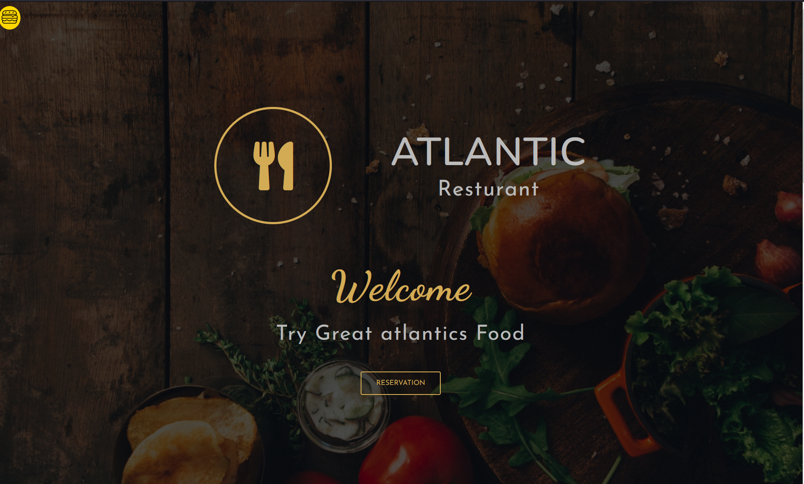

# 🥘It is a Responsive Resturant website(front-end) with animation

## It is responsive and i used sass and W3JS

### ✍️It is responsive for phone, tablet and ipad, laptop and desktop, Tv

---

## 🛰️ <a href='https://farhad-here.github.io/resturant_website/'>DEMO</a>

# 🖼️Image

## 👨‍💻Used Technologies
- HTML5
- CSS
- Sass
- NodeJs(just for installing sass and watch sass)
- Animation/transition
- W3Js
